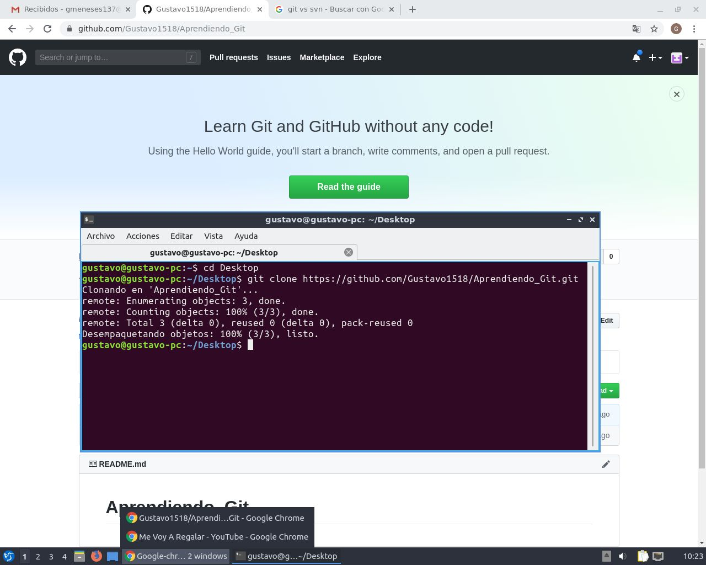

# Aprendiendo_Git
## Tutorial basado en Linux
==================================

<!-- START doctoc generado TOC por favor mantenga el comentario aquí para permitir la actualización automática ->
<!-- NO EDITE ESTA SECCIÓN, EN LUGAR RE-RUN doctoc PARA ACTUALIZAR -->

**Tabla de contenido**  *generado con: [DocToc](https://github.com/thlorenz/doctoc)*

- [Instalar Git](#instalar-Git)
<!-- END doctoc generó TOC por favor mantenga un comentario aquí para permitir la actualización automática -->

# Instalacion de Git.
Si quieres instalar Git en Linux a través de un instalador binario, en general puedes hacerlo mediante la herramienta básica de administración de paquetes que trae tu distribución

*$ apt-get install git*

