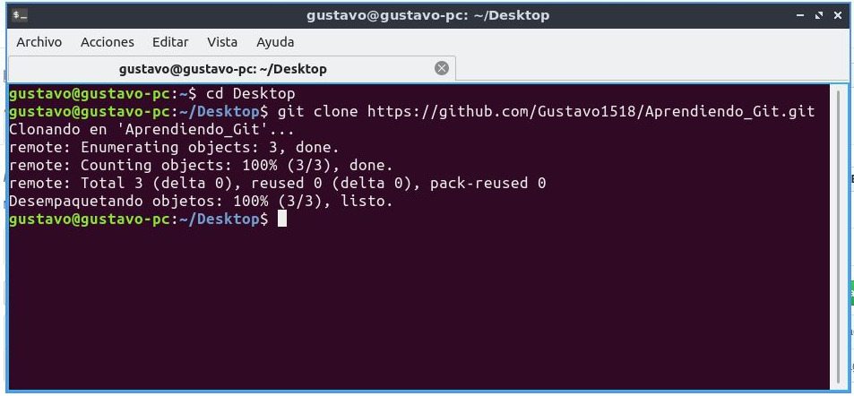
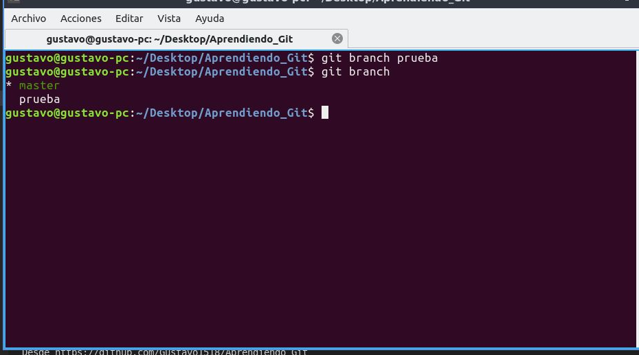
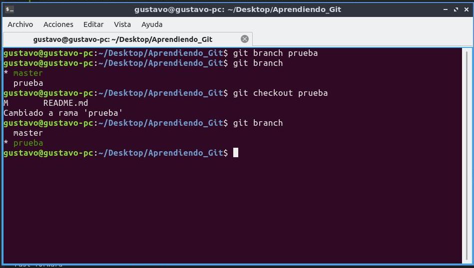
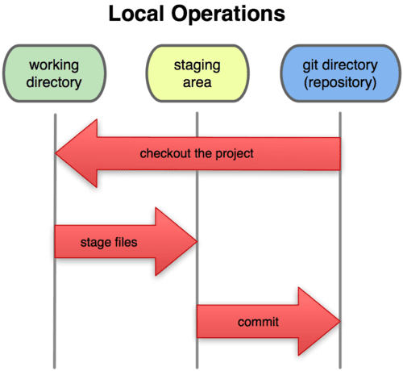

# Aprendiendo_Git
## Tutorial basado en Linux

### Git vs svn https://github.com/Gustavo1518/Git-vs-Svn
==================================

<!-- START doctoc generado TOC por favor mantenga el comentario aquí para permitir la actualización automática ->
<!-- NO EDITE ESTA SECCIÓN, EN LUGAR RE-RUN doctoc PARA ACTUALIZAR -->

**Tabla de contenido**  *generado con: [DocToc](https://github.com/thlorenz/doctoc)*

- [Primeros pasos con Git](#primeros-pasos-con-git)
- [Crea un repositorio](#crea-un-repositorio)
- [Clona tu repositorio](#clona-tu-repositorio)
- [Subir cambios a repositorio remoto](#subir-cambios-a-repositorio-remoto-git-push)
- [Comandos basicos de git](#comandos-basicos-de-git)
- [Ramas](#ramas)
- [Los tres estados de git](#los-tres-estados-de-git)
- [git stage y git commit](#git-stage-y-git-commit)

<!-- END doctoc generó TOC por favor mantenga un comentario aquí para permitir la actualización automática -->

# Primeros pasos con Git

## Instalacion de Git.

Si quieres instalar Git en Linux a través de un instalador binario, en general puedes hacerlo mediante la herramienta básica de administración de paquetes que trae tu distribución.
> $ apt-get install git

## Configuracion de usuario y direccion de correo.

podemos acceder a los ajustes de configuración de Git a través del comando git config.

> $ git config --global user.name "John Doe"

> $ git config --global user.email johndoe@example.com

# Crea un repositorio.

Dirigite a (https://github.com/) y registrate es totalmente gratis.

1. Una vez registrado dirigite a la parte superior derecha de la pagina de inicio y pulse el icono + el cual desplega la opcion de new repository

2. Escribe un nombre corto y fácil de recordar para tu repositorio. Por ejemplo: "hola-mundo".

3. También puedes agregar una descripción de tu repositorio. Por ejemplo, "Mi primer repositorio en GitHub".

4. Elija una visibilidad del repositorio.

5. Selecciona Inicializar este repositiro con un archivo README.

6. Haz clic en Crear repositorio.

# Clona tu repositorio.

1. Una vez creado el repositorio haga clic en Clonar o descargar.

2. Copia la url que se te muestra.

3. Dirigete a la carpeta donde quieras que este tu repositorio y ejecuta el comando git clone y dale enter.

Felicidades ahora cuentas con tu repositorio de manera local en tu equipo.

# Subir cambios a repositorio remoto: git push.

1. Genera algun cambio dentro de tu archivo README.md Como se muestra en la imagen y guardalo.

2. Una vez guardado los cambios tendremos que hacer uso de unos comandos para actualizar nuestra rama a nuestro servidor remoto.

# Comandos basicos de git.

1. git init: este comando se usa para inicializar un repositorio git.

> git init

2. git add: Este comando se utiliza para agregar archivos al index.

>git add nombre_archivo

3. git clone: Este comando se utiliza para clonar un repositorio como lo hemos visto anteriormente.

>git clone alex@93.188.160.58:/path/to/repository

4. git commit: El comando commit es usado para cambiar a la cabecera. Ten en cuenta que cualquier cambio comprometido no afectara al repertorio remoto.

> git commit –m “Mensaje Descriptivo”

5. git status: Este comando muestra la lista de los archivos que se han cambiado junto con los archivos que están por ser añadidos o comprometidos

> git status

6. git push: Este es uno de los comandos más básicos. Un simple push envía los cambios que se han hecho en la rama principal de los repertorios remotos que están asociados con el directorio que está trabajando

>git push  origin master

7. git checkout: El comando checkout se puede usar para crear ramas o cambiar entre ellas. Por ejemplo, el siguiente comando crea una nueva y se cambia a ella

> command git checkout -b banch-name

Cambia a la rama creada
 
> git checkout branch-name

8. git remote: El comando git se usa para conectar a un repositorio remoto. El siguiente comando muestra los repositorios remotos que están configurados actualmente

> git remote -v

Este comando te permite conectar al usuario con el repositorio local a un servidor remoto

> git remote add origin <93.188.160.58>

9. git branch: Este comando se usa para listar, crear o borrar ramas. Para listar todas las ramas se usa:

>git branch

Para borrar la rama.

>git branch -d branch-name

10. git pull: Para poder fusionar todos los cambios que se han hecho en el repositorio local trabajando

>git pull

11. git merge: Este comando se usa para hacer una lista de conflictos. Para poder ver conflictos con el archivo base usa.

> git diff --base file-name

12. git tag: Etiquetar se usa para marcar commits específicos con asas simples.

> git tag 1.1.0 instert-commitID-here

13. git log: Ejecutar este comando muestra una lista de commits en una rama junto con todos los detalles. Por ejemplo

> commit 15f4b6c44b3c8344caasdac9e4be13246e21sadw
>Author: Alex Hunter alexh@gmail.com

14. git stash: Este es uno de los comandos menos conocidos, pero ayuda a salvar cambios que no están por ser comprometidos inmediatamente, pero temporalmente

> git stash

15. git-stage: agrega el contenido del archivo al área de preparación

> git stage
# Ramas.

La creacion de ramas en un proyecto de desarrollo es esencialmente importante cuando deseamos 
hacer pruebas de codigo sin afectar a ramas principales.

para crear una rama nueva en nuestro proyecto utilizaremos el comando git branch el cual si observamos
resive el nombre de la nueva rama que deseamos crear como me muestra en la imagen siguiente

dirigete ala carpeta de tu proyecto y has lo siguiente para crear tu nueva rama.

Para movernos a la rama creada aremos uso del siguiente comando git checkout como podemos observar
nos hemos cambiado a la rama "prueba" cabe destacar que el comando git branch tal cual nuestra la rama
donde nos encontramos actualmente.

## Eliminar tu rama

para eliminar la rama creada localmente dirigite a la carpeta de tu repositorio y ejecuta el
siguiente comando. La opcion -D elimina la rama sin importar el estado en que se encuentre asi que mucho cuidado.

> git branch -D prueba

Si queremos borrar una rama en remoto, ingresamos a la consola y ejecuta el siguiente comando.

> git push origin --delete prueba

# Los tres estados de git.

1. Confirmado (committed): Estado que nos dice que nuestros archivos están almacenado de manera segura en nuestro BD local.

2. Modificado (modified) Estado que avisa que modificaste algún archivo y no lo guardaste en la BD local.
3. Preparado (staged) Estado que avisa que hemos marcado un archivo modificado para luego realizar una confirmación ("commit") en otras palabras son los archivos que hemos seleccionado para añadirlo a la versión actual.

Esto nos lleva  a las 3 secciones principales de Git:

1. El directorio de Git (Git directory): Es donde se almacena la información.
2. El área de preparación (Stating area):  Es donde esta la información para la siguiente confirmación ("commit").
3. El directorio de trabajo (Working directory): Es donde se elabora o modifica la información.

# git stage y git commit.

**git stage** agrega el contenido del archivo al área de preparación es decir este es un sinonimo de **git add**

**git commit**  Graba los cambios en el repositorio, el commit es un hilo directo de HEAD.